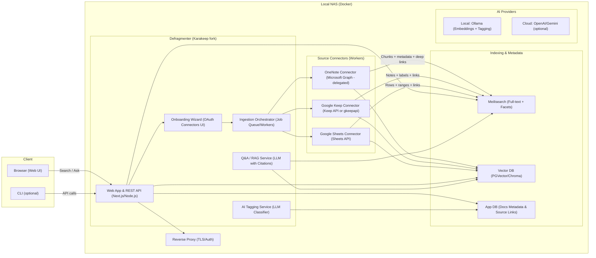
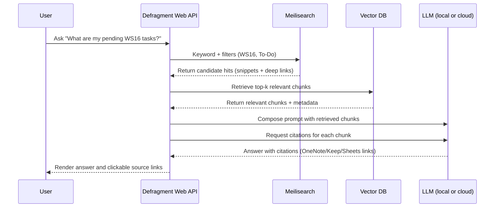

# Defragmenter (Karakeep fork) — Product Architecture & Spec

**Purpose:** A self‑hosted, NAS‑friendly web app that **connects OneNote, Google Keep, Google Sheets**, and more; **automatically ingests** selected content; **keeps a local index/vector DB up‑to‑date**; enables **semantic search** and **Q&A with citations**; and provides a polished **web UI + CLI**.  
**Foundation:** Fork of **Karakeep** (web-first, Docker-ready, AI tagging), extended with **source connectors** and **onboarding**.

---

## Abstract: Use Case & Need

Professionals accumulate notes across multiple tools (OneNote page hierarchies, Google Keep labels, Google Sheets rows). Finding, organizing, and extracting insights across these silos is hard and time‑consuming. **Defragmenter** provides a **single, private hub** to:

- **Connect sources** via OAuth (Microsoft Graph for OneNote; Google APIs for Keep/Sheets).  
- **Select scopes** (notebooks/sections; labels; sheets/ranges).  
- **Build & maintain** a local index and **vector database** with **AI tagging** (Ideas, Book Summaries, To‑Dos), **semantic search**, and **Q&A with citations** that link back to originals.  
- **Host on NAS** (Synology/QNAP/Unraid) via Docker; use a browser and CLI to work with your knowledge.

**Why Karakeep?** Karakeep already offers a **web UI**, **Docker deployment**, **search via Meilisearch**, and **AI auto‑tagging** (OpenAI/Ollama). Extending it minimizes your time‑to‑value.  
**References:** Karakeep features & docs; Docker deployment; CLI; AI tagging; Meilisearch backend.  

- <https://github.com/karakeep-app/karakeep>  
- <https://docs.karakeep.app/>  
- <https://www.meilisearch.com/docs>

---

## User Stories & Workflows

### US‑1: Connect & Index

**As a user**, I want to connect my note sources and pick scopes so Defragmenter ingests the right content automatically.  
**Workflow:** Profile → OAuth → Select scopes (OneNote notebooks/sections; Keep labels; Sheets ranges) → Start ingest → View progress → Search immediately.

### US‑2: Search Across Sources

**As a user**, I want fast, unified search across OneNote, Keep, and Sheets.  
**Workflow:** Enter query → Get ranked results with **source badges** and **deep links** → Filter by category/tags/date.

### US‑3: Ask Questions with Citations

**As a user**, I want Q&A that cites original sources so I can trust answers.  
**Workflow:** Ask question → System retrieves relevant chunks → LLM composes an answer → UI shows **citations** (OneNote page URL, Keep note URL, Sheets A1 range).

### US‑4: Auto‑Categorization

**As a user**, I want AI to assign categories (Ideas, Book Summaries, To‑Dos) and domain tags (e.g., ADAS, KPI) to my notes for faceted browsing.  
**Workflow:** Ingestion runs a classifier over titles/snippets + preserves source metadata (labels/sections) → UI facets for Category/Source/Date.

### US‑5: Continuous Sync

**As a user**, I want the index/vector DB to stay fresh without manual downloads.  
**Workflow:** Scheduled delta sync per source (timestamps/ETags) → re‑index changed items only → “Recent updates” panel shows changes.

---

## System Architecture (Logical View)



#### References

- Microsoft Graph OneNote API: <https://learn.microsoft.com/en-us/graph/integrate-with-onenote> • <https://learn.microsoft.com/en-us/graph/onenote-get-content>
- Google Keep API / gkeepapi: <https://developers.google.com/workspace/keep/api/guides> • <https://github.com/kiwiz/gkeepapi>
- Google Sheets API: <https://developers.google.com/sheets/api>
- Karakeep + Meilisearch: <https://github.com/karakeep-app/karakeep> • <https://www.meilisearch.com/docs>

### Deployment View (NAS Containers)  

```mermaid
flowchart TB
  subgraph nas["Local NAS (Docker)"]
    reverseProxy["Reverse Proxy (TLS / HTTPS)"]
    web["defragment-web (Karakeep fork)"]
    chrome["chrome-headless"]
    meili["meilisearch"]
    vectorDb["vector-db (PGVector or Chroma)"]
    onenoteConnector["connector-onenote (worker)"]
    keepConnector["connector-keep (worker)"]
    sheetsConnector["connector-sheets (worker)"]
    ollama["ollama (optional local LLM)"]
    volData["/volume/data"]
    volMeili["/volume/meili_data"]
    volVector["/volume/pgdata_or_chroma"]
  end

  reverseProxy --> web

  web --> meili
  web --> chrome
  web --> vectorDb
  web --> ollama

  onenoteConnector --> web
  keepConnector --> web
  sheetsConnector --> web

  web --- volData
  meili --- volMeili
  vectorDb --- volVector
  ```

#### Refs

- Karakeep Docker baseline: <https://docs.karakeep.app/> • <https://github.com/karakeep-app/karakeep>
- Meilisearch: <https://www.meilisearch.com/docs>

### Ingestion & QA Sequences  

#### Onboarding & First Index

```mermaid
sequenceDiagram
  participant User as User
  participant Web as Defragment Web API
  participant Google as Google OAuth (Sheets/Keep)
  participant Microsoft as Microsoft OAuth (Graph OneNote)
  participant Orchestrator as Ingestion Orchestrator
  participant OneNote as OneNote Connector
  participant Keep as Keep Connector
  participant Sheets as Sheets Connector
  participant Meili as Meilisearch
  participant Vectors as Vector DB
  participant Tagger as AI Tagging Service

  User->>Web: Connect sources (Google / Microsoft)
  Web->>Google: OAuth (Sheets / Keep scopes)
  Web->>Microsoft: OAuth (Graph OneNote scopes)
  User->>Web: Select scopes (notebooks/sections, labels, sheets/ranges)

  Web->>Orchestrator: Enqueue ingestion jobs (selected scopes)

  Orchestrator->>OneNote: Fetch pages (title, HTML, updated_at, links)
  OneNote->>Meili: Index chunks and metadata
  OneNote->>Vectors: Store embeddings

  Orchestrator->>Keep: Fetch notes (text, labels, links)
  Keep->>Meili: Index chunks and metadata
  Keep->>Vectors: Store embeddings

  Orchestrator->>Sheets: Fetch rows and ranges (links)
  Sheets->>Meili: Index chunks and metadata
  Sheets->>Vectors: Store embeddings

  Web->>Tagger: Auto-tag items (Ideas, Book Summaries, To-Dos)
  Tagger-->>Web: Persist tags in metadata

  Meili-->>Web: Search-ready
  Vectors-->>Web: Embeddings-ready
  ```

#### Scheduled Delta Sync

```mermaid
sequenceDiagram
  participant Scheduler as Scheduler
  participant Connector as Source Connector
  participant Meili as Meilisearch
  participant Vectors as Vector DB
  participant Web as Defragment Web API
  participant User as User

  Scheduler->>Connector: Run periodic sync (e.g., every 15–30 min)
  Connector->>Connector: Check delta (lastModified, ETag, content hash)

  alt Changed items detected
    Connector->>Meili: Reindex changed chunks and metadata
    Connector->>Vectors: Regenerate embeddings
    Meili-->>Web: Index updated
    Vectors-->>Web: Vectors updated
  else No changes
    Connector-->>Scheduler: No-op
  end

  Web-->>User: Recent updates panel reflects changes

```

#### Q&A with Citations (RAG)



## Tech Stack

- **Base:** Karakeep (Next.js/Node.js), Docker Compose for NAS.  
  <https://github.com/karakeep-app/karakeep> • <https://docs.karakeep.app/>
- **Search:** Meilisearch for full‑text and facets.  
  <https://www.meilisearch.com/docs>
- **Vector DB:** PGVector (Postgres extension) or Chroma; configurable.  
  <https://github.com/pgvector/pgvector> • <https://www.trychroma.com/>
- **LLMs:**  
  - Local: **Ollama** for embeddings & tagging (privacy‑first). <https://ollama.com/>  
  - Cloud: **OpenAI** / **Gemini** for higher‑end Q&A (opt‑in). <https://platform.openai.com/> • <https://ai.google.dev/gemini-api>
- **APIs:**  
  - **Microsoft Graph OneNote** (delegated auth; read notebooks/sections/pages).  
    <https://learn.microsoft.com/en-us/graph/integrate-with-onenote> • <https://learn.microsoft.com/en-us/graph/onenote-get-content>  
  - **Google Keep** (Workspace) / **`gkeepapi`** (personal).  
    <https://developers.google.com/workspace/keep/api/guides> • <https://github.com/kiwiz/gkeepapi>  
  - **Google Sheets** (read ranges/values).  
    <https://developers.google.com/sheets/api>

## Connectors & Extensibility

### Connector Interface (high‑level)

```typescript
interface SourceConnector {
  listScopes(userAuth: Auth): Promise<Scope[]>;               // notebooks/sections | labels | sheets/ranges
  fetchDelta(userAuth: Auth, since: Date): AsyncIterable<Item>;
  normalize(raw: any): IndexedItem;                           // {title, snippet, tags, link, updated_at}
  index(item: IndexedItem): Promise<void>;                    // push to Meilisearch + Vector DB
}

```

#### Built‑in Connectors (MVP)

- OneNote: Microsoft Graph; delegated OAuth; HTML + preview; deep links to pages.
- Keep: Workspace Keep API, or gkeepapi for personal accounts; text + labels + links.
- Sheets: Sheets API; selected ranges; deep links (A1 notation).

- Extensible: Add Notion, Obsidian, Google Drive, Dropbox by implementing the same interface.

## Data Model (Indexed Item)

```json
{
  "id": "uuid-or-source-id",
  "source": "onenote | keep | sheets",
  "title": "string",
  "snippet": "short chunk of text",
  "tags": ["Ideas", "BookSummaries", "ToDos", "ADAS", "KPI"],
  "labels": ["Keep labels", "OneNote section name"],
  "link": "deep link (OneNote page URL / Keep note / Sheets A1 range)",
  "updated_at": "2026-01-09T10:09:00-05:00",
  "embeddings_id": "vector key",
  "metadata": {
    "notebook": "WS16",
    "section": "Hands-Off",
    "sheet": "KPI Tracker",
    "range": "A2:C50"
  }
}

```

## OpenSpec‑Style API Outline (for onboarding & jobs)

```YAML

openapi: 3.0.3
info:
  title: Defragmenter API
  version: 0.1.0
paths:
  /auth/google/oauth/init:
    get:
      summary: Start Google OAuth (Sheets/Keep)
  /auth/google/oauth/callback:
    get:
      summary: Handle Google OAuth callback

  /auth/microsoft/oauth/init:
    get:
      summary: Start Microsoft OAuth (OneNote)
  /auth/microsoft/oauth/callback:
    get:
      summary: Handle Microsoft OAuth callback

  /sources:
    get:
      summary: List connected sources for current user

  /sources/{source}/scopes:
    get:
      summary: List selectable scopes (notebooks/sections | labels | sheets/ranges)

  /ingest/jobs:
    post:
      summary: Enqueue ingestion for selected scopes
    get:
      summary: List ingestion jobs & status

  /search:
    get:
      summary: Keyword search across index; returns hits with citations

  /qa:
    post:
      summary: Ask question (RAG); returns answer + citations

  /updates/recent:
    get:
      summary: Recent changes (delta sync results)

```

## Security & Privacy

- OAuth tokens stored encrypted at rest; refresh tokens rotated securely.
- Delegated auth for OneNote per Microsoft’s change (app‑only disabled as of Mar 31 2025).
- <https://learn.microsoft.com/en-us/graph/integrate-with-onenote>
- Reverse proxy terminates TLS; admin endpoints limited to LAN/VPN; optional SSO.
- Rate limits & backoff on source API calls; logging & alerting for failures.
- No source write‑back: all operations are read‑only.

## Roadmap — AI Features & Agents

- Phase 1 (MVP)

  - Automated ingestion; delta sync; Meilisearch + vector DB.
  - tagging; semantic search; Q&A with citations (local Ollama).
  - Web UI + CLI.

- Phase 2

  - Chat with your documents (conversational RAG) with session memory.
  - Cloud LLM opt‑in (OpenAI/Gemini) per user/token; higher quality synthesis.

- Phase 3

  - External agents: expose local DB via authenticated API; workflows like
  - “Generate project summaries”, “Extract action items”, “Create meeting briefs”.

- Phase 4

  - Knowledge graph view (relationships between notes; cross‑source linking).
  - Multi‑user & RBAC; per‑source permission awareness; notifications/automation.

## Non‑Goals (Initial)

- Two‑way sync/write‑back to sources.
- Full fidelity WYSIWYG editing of source notes inside Defragmenter.
- Heavy document transformations beyond chunking/summarization for retrieval.

## Risks & Mitigations

- OneNote auth complexity: Use delegated OAuth; cache tokens; robust refresh logic; test throttling.
- <https://learn.microsoft.com/en-us/graph/integrate-with-onenote>
- Google Keep personal accounts: Use gkeepapi (OSS) where official API is unavailable; clearly mark “community client.”
- <https://github.com/kiwiz/gkeepapi> • <https://pypi.org/project/gkeepapi/>
- Index freshness: Implement reliable delta detection (timestamps, ETags, content hashes); per‑connector backoff & exponential retry.
- LLM cost/latency: Default to Ollama local; allow opt‑in cloud only for advanced tasks

## References (Documentation & Projects)

- Karakeep (features, Docker, CLI, AI tagging):
<https://github.com/karakeep-app/karakeep> • <https://docs.karakeep.app/>
- Meilisearch (search & facets):
<https://www.meilisearch.com/docs>
- Microsoft Graph OneNote API (read notebooks/sections/pages; content/preview; delegated auth):
<https://learn.microsoft.com/en-us/graph/integrate-with-onenote> • <https://learn.microsoft.com/en-us/graph/onenote-get-content>
- Google Keep API (Workspace) & gkeepapi (personal):
<https://developers.google.com/workspace/keep/api/guides> • <https://github.com/kiwiz/gkeepapi> • <https://pypi.org/project/gkeepapi/>
- Google Sheets API:
<https://developers.google.com/sheets/api>
- Ollama (local models):
<https://ollama.com/>
- PGVector / Chroma:
<https://github.com/pgvector/pgvector> • <https://www.trychroma.com/>


## Example Environment Configuration (.env)

```bash
# Karakeep API key (for connectors and internal API auth)
KARAKEEP_API_KEY=your_api_key

# Meilisearch
MEILI_ADDR=http://meilisearch:7700

# Headless Chrome for page captures (Karakeep)
BROWSER_WEB_URL=http://chrome:9222

# Microsoft Graph (OneNote - delegated auth)
GRAPH_CLIENT_ID=...
GRAPH_TENANT_ID=...
GRAPH_REDIRECT_URI=https://nas.domain/defragment/oauth/callback
GRAPH_SCOPES=Notes.Read

# Google (Sheets/Keep)
GOOGLE_CLIENT_ID=...
GOOGLE_CLIENT_SECRET=...
GOOGLE_REDIRECT_URI=https://nas.domain/defragment/oauth/callback
GOOGLE_SCOPES=https://www.googleapis.com/auth/spreadsheets.readonly https://www.googleapis.com/auth/keep.readonly

# Optional LLMs
OLLAMA_HOST=http://ollama:11434
OPENAI_API_KEY=...
GEMINI_API_KEY=...
```

## Acceptance Criteria (MVP)

- User can connect Google/Microsoft accounts and select scopes.
- Ingestion builds Meilisearch + Vector DB with AI tags, shows progress.
- Search returns ranked results with filters and citations (deep links).
- Q&A answers include citations to originals.
- Delta sync updates the index/vector DB automatically; visible in “Recent updates.”
- Runs on NAS via Docker (web reachable via reverse proxy + TLS).

## Next Steps

- Fork Karakeep and create defragmenter repo.
- Implement connector stubs (OneNote, Keep, Sheets) and the onboarding wizard.
- Wire ingestion to Meilisearch + Vector DB and AI tagging (Ollama first).
- Add Q&A (RAG) service with citations.
- Ship Docker Compose and a Synology/QNAP‑friendly guide.
- Validate with a sample corpus; tune chunking and facets (Ideas/BookSummaries/To‑Dos).

## Repo Layout example

```shell
defragmenter/
├─ apps/
│  ├─ web/                  # Next.js UI (Karakeep fork)
│  ├─ api/                  # REST endpoints (sources, jobs, search, QA)
│  └─ workers/              # Job workers (ingestion, tagging, delta sync)
├─ packages/
│  ├─ connectors/
│  │  ├─ onenote/           # Graph client, scopes, delta logic
│  │  ├─ keep/              # Keep API / gkeepapi adapter
│  │  └─ sheets/            # Sheets ranges adapter
│  ├─ ingestion/            # Chunker, parsers, normalizers
│  ├─ search/               # Meilisearch client, schemas, facets
│  ├─ vectors/              # PGVector/Chroma wrappers
│  ├─ llm/                  # Ollama/OpenAI/Gemini (embeddings, QA, tagging)
│  └─ common/               # Types, config, logging
├─ docker/
│  ├─ docker-compose.yml    # web, meilisearch, chrome, connectors, vdb
│  └─ caddy/                # reverse proxy TLS
├─ docs/
│  └─ architecture.md       # this file
└─ .env.example

```

## Connector Scope Examples

- OneNote scopes: list notebooks → sections → selected sections; expand pages with lastModifiedDateTime for delta.
- Keep scopes: list labels; select one or more labels; ingest notes tagged with those labels.
- Sheets scopes: list spreadsheets; select tabs and/or A1 ranges; ingest rows that match filters.
